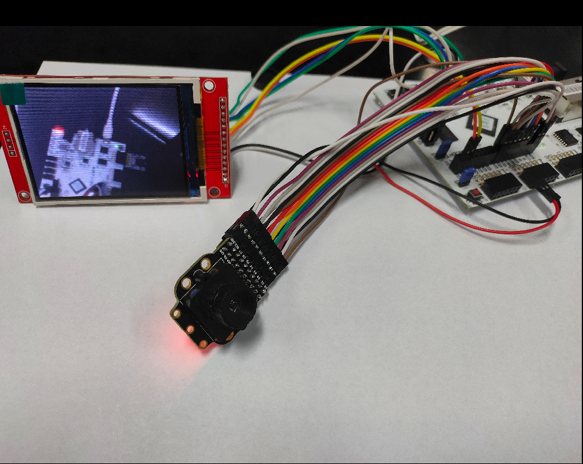

# OV7725(with fifo) linux driver
* It's a proof of concept driver to explain how to use a camera with fifo through gpio
when SOC lacks a peripheral for digital camera interface

## test picture
* SoC platform: linux-on-litex-vexriscv(https://github.com/litex-hub/linux-on-litex-vexriscv).
* board: Digilent Arty A7

